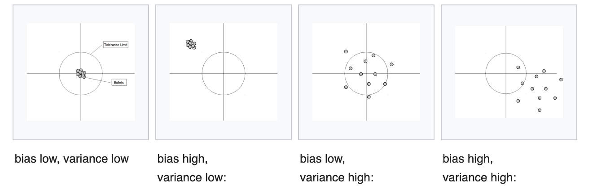

# Model Training Considerations

## Model Selection

- Considerations
	- model performance
	- complexity, maintainability, and available resources
- Probabilistic methods
	- score models both on their performance and complexity 
	- Akaike Information Criterion (AIC)
	- Bayesian Information Criterion (BIC)	
		- ACI and BIC are two ways of scoring a model based on its log-likelihood and complexity.
	- Minimum Description Length (MDL)
		- provides another scoring method from information theory that can be shown to be equivalent to BIC
	- Structural Risk Minimization (SRM)
- Resampling methods
	- Random train/test splits (hold out)
		- training set is used to train the model 
		- the validation/test set is used to validate it on data it has never seen before
		- why training set
			- fit model parameters
		- why validation set
			- detect over-fitting and to assist in hyper-parameter search
			- so that you can evaluate the performance of your model for different combinations of hyperparameter values (e.g. by means of a grid search process) and keep the best trained model
		- why test set
			- measure the performance of the model
			- compare different models against each other in an unbiased way, by basing your comparisons in data that were not use in any part of your training/hyperparameter selection process. 
			- You cannot compare based on the validation set, because that validation set was part of the fitting of your model. You used it to select the hyperparameter values!
			- unseen data
		 `from sklearn.model_selection import train_test_split`
		 - use hold out instead of cross validation when data set is really big or need to save time
	- Cross-Validation
		```python
		from sklearn.cross_validation import cross_val_score, cross_val_pred
		# print cross validation scores
		scores = cross_val_score(model, df, y, cv=5)
		# make cross validation predictions
		predictions = cross_val_pred(model, df, y, cv=5)
		```
		- k-folds
			
			```python
			from sklearn.model_selection import KFold
			kf = KFold(n_splits=5)
			kf.get_n_splits(X) 
			for train_index, test_index in kf.split(X):
				X_train, X_test = X[train_index], X[test_index]
				y_train, y_test = y[train_index], y[test_index]
			```
			- split our data into K parts, let’s use K=3 for example, part 1, part 2 and part 3. We then build three different models, each model is trained on two parts and tested on the third. Our first model is trained on part 1 and 2 and tested on part 3. Our second model is trained to on part 1 and part 3 and tested on part 2 and so on.
			- each example appears in a test set only once
		- Leave One Out
			```python
			from sklearn.model_selection import LeaveOneOut
			loo = LeaveOneOut()
			loo.get_n_splits(X)
			```
			- For each instance in our dataset, we build a model using all other instances and then test it on the selected instance.
		- k-fold vs leave one out
			- the more the folds, the longer and more memory computation takes
			- the fewer the folds, the more bias there is
			- small set: leave one out
			- bigger set: k=3
		- Stratified Cross Validation
			- keep the same proportion of different classes in each fold
		- benefit of cross-validation
			- hyperparameters tuning
				- the number of trees in Gradient Boosting classifier
				- hidden layer size or activation functions in a Neural Network
				- type of kernel in an SVM and many more
			- we’re able to use all our examples both for training and for testing while evaluating our learning algorithm on examples it has never seen before.
			- we can be more confident in our algorithm performance
				- if performance metrics very different across folds -> algorithms inconsistent or data inconsistent
	- Bootstrap
- time series data
	- cross-validation
	- validation set needs to come chronologically after the training subset
	- forward chaining
		- multiple train test sets
		- test sets only have 1 observation
		- corresponding training set consists of all the observations that occurred prior to the test observation (no future observation)
		- ![Image result for time series cross validation][image-10]
		- The forecast accuracy is computed by averaging over the test sets


## Bias vs Variance

The bias–variance tradeoff is the property of a model that the variance of the parameter estimated across samples can be reduced by increasing the bias in the estimated parameters. The bias–variance dilemma or bias–variance problem is the conflict in trying to simultaneously minimize these two sources of error that prevent supervised learning algorithms from generalizing beyond their training set.

The bias error is an error from erroneous assumptions in the learning algorithm. High bias can cause an algorithm to miss the relevant relations between features and target outputs (underfitting).

The variance is an error from sensitivity to small fluctuations in the training set. High variance may result from an algorithm modeling the random noise in the training data (overfitting).

The bias–variance decomposition is a way of analyzing a learning algorithm's expected generalization error with respect to a particular problem as a sum of three terms, the bias, variance, and a quantity called the irreducible error, resulting from noise in the problem itself.



- reduce variance & bias
	- reduce variance: larger training set; reduce model complexity; bagging
	- reduce bias: add features; more complex model; boosting
	- linear and Generalized linear models can be regularized to decrease their variance at the cost of increasing their bias
	- In artificial neural networks, the variance increases and the bias decreases as the number of hidden units increase, although this classical assumption has been the subject of recent debate. Like in GLMs, regularization is typically applied.
	- In k-nearest neighbor models, a high value of k leads to high bias and low variance.
	- In instance-based learning, regularization can be achieved varying the mixture of prototypes and exemplars.
	- In decision trees, the depth of the tree determines the variance. Decision trees are commonly pruned to control variance.

## Model Evaluation
- what to evaluate
	- tune hyperparameters 
	- how big training set needs to be
	- how frequent to retrain the model

## Choose the right loss function

- binary classification
	- cross entropy
		- $-(ylog(p)+(1-y)log(1-p))$
		- only applicable for binary classification & sensitive to background click through rate
	- normalized cross entropy
		- predictive logloss / cross emtropy of background click through rate => insensitive to background CTR
	- AUC
	- logloss: $-p1log(p1)-p2log(p2)-p3log(p3)-...$
	- in the click through rate (CTR) prediction, facebook uses normalized cross entropy aka logloss to make the loss less sensitive to the background conversion rate
- forecast
	- mean absolute percentage error (MAPE)
    	- is your target value skew?
		- MAPE pic
	- symmetric absolute percentage error (SMAPE)
    	- not symmetric, treats under and over forecast differently
		- SMAPE pic
	- uber uses RNN, gradient boosting trees, and support vector regressors for various problems including marketplace forecasting, hardware capacity planning, and marketing
	- doordash uses quantile loss to forecast food delivery demand
		- quantile loss pic

## Requirements

- handle large volume of data
- at low costs


## Re-training

- reason
	- because data distribution is not stationary
	- temporal changes: new viral video to recommend
	- keep the model fresh to sustain performance 
	- avoid showing repetitive feed to user
	- especially in AdTech & recommendation/personalization use cases. important to capture changes in user's behavior and trending topics
	- how to adapt to user behavior changing over time?
		- multi-arm bandit
		- bayesian logistic regression model to update prior data
		- use different loss functions to be less sensitive with click through rates
- requirements
	- fast training pipeline that scales well with big data
	- balance between model complexity & training time
- algorithm: bayesian logistic regression
- design a scheduler to retrain model on a regular basis
	- airflow
		- pros: good GUI; strong support community; independent scheduler 
		- cons: less flexibility; not easy to manage massive pipelines
	- luigi
		- pros: has a lot of libraries (hive, pig, google big query, redshift)
		- cons: not very scalable (tight with cron); not easy to create/test tasks
- save model to S3


#### in the click through rate (CTR) prediction, facebook uses normalized cross entropy aka logloss to make the loss less sensitive to the background conversion rate

### forecast

#### mean absolute percentage error (MAPE)

##### is your target value skew?

##### 

#### symmetric absolute percentage error (SMAPE)

##### not symmetric, treats under and over forecast differently

##### 

#### uber uses RNN, gradient boosting trees, and support vector regressors for various problems including marketplace forecasting, hardware capacity planning, and marketing

#### doordash uses quantile loss to forecast food delivery demand


# Optimization

## Optimizers
- updates weights and biases to reduce the error
- gradient descent
	- keep updating the model parameters to move closer to the values that results in smaller cost
	- partial derivative of cost function with respect to each model parameter
	- learning rate: alpha
	- batch
		- use all training instances to update the model parameters in each iteration
		- independent, parallizable
	- mini-batch
		- use smaller batch size
		- check how much parallization your batch has (GPU)
	- stochastic gradient descent (SGD)
		- update parameters using 1 training instance
			- converge more quickly
	- Adagrad
		- adapts learning rate specifically to individual features
			- sparse dataset
			- diminishing learning rate problem
	- RMSprop
		- instead of letting all the gradients accumulate for momentum, only calculates gradient in a fixed window
	- Adam
		- adaptive moment estimation
		- adding fractions of past gradients to calculate current gradients

## Model Categories
- generative
	- learn categories of data 
	- learn the actual joint probability P(x, y)
- discrimative
	- learns the distinction between different categories
	- learns the conditional distribution P(y|x)
- Convex
	- smooth = infinitely derivable
	- convex = has a global optimum
- non-convex


# OTHER MODEL CONSIDERATIONS

## Testing

## Debugging

- is feature's distribution different in test vs prod?
- change in seasonality? (training data is out of date)
- is feature engineering done the same offline & online?
- did our model over-fit?
	- use validation set for final model quality measurement
- did our model under-fit?
	- more complex model
	- more feature interactions
- can we add more features?
	- e.g., consider a scenario where a movie actually liked by the user was ranked very low by our recommendation system. On debugging, we figure out that the user has previously watched two movies by the same actor, so adding a feature on previous ratings by the user for this movie actor can help our model perform better in this case.
- do we not have enough training data?
	- underperforming in some scenarios -> increase examples accordingly


## Transfer Learning

- apply pre-learned model to new task -> higher accuracy & less time
- many problems share common sub-problems
	- e.g. understanding texts -> recommender system; ads; search
- limited training data. and some pre-trained model don't need labeled training data (word2vec)
- 2 ways to use transfer learning
	- Extract features from useful layers: Keep the initial layers of the pre-trained model and remove the final layers. Add the new layer to the remaining chunk and train them for final classification.
	- Fine-tuning: Change or tune the existing parameters in a pre-trained network, i.e., optimizing the model parameters during training for the supervised prediction task. 
		- say with ImageNet, first few layers are detecting edges, or colors, can keep. then the next few layers are detecting shapes. freeze the weight of most of the starting layers of the pre-trained model and fine-tune only the end layers
		- the more training data you have, the more layers you can fine tune

## iterative model improvement

## Serving Logic w/ Multiple Models

- change logic in serving models
    - e.g. in ad prediction systems, depending on the type of ad candidates (ios device vs android), round to different models for scoring
- exploration-exploitation tradeoff
	- give user too many new ads -> low conversions give user too few ads -> not enough exploration
	- over-exploits historic data -> user dont view new videos too much fresh new content -> may not be very relevant 
- what if model is under-explored?
	- introduce randomization, 2% of requests can get random candidates the rest gets sorted candidates
- thompson sampling: decide at time t, which action to take based on the reward