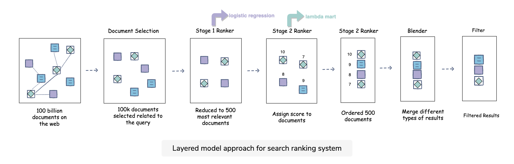
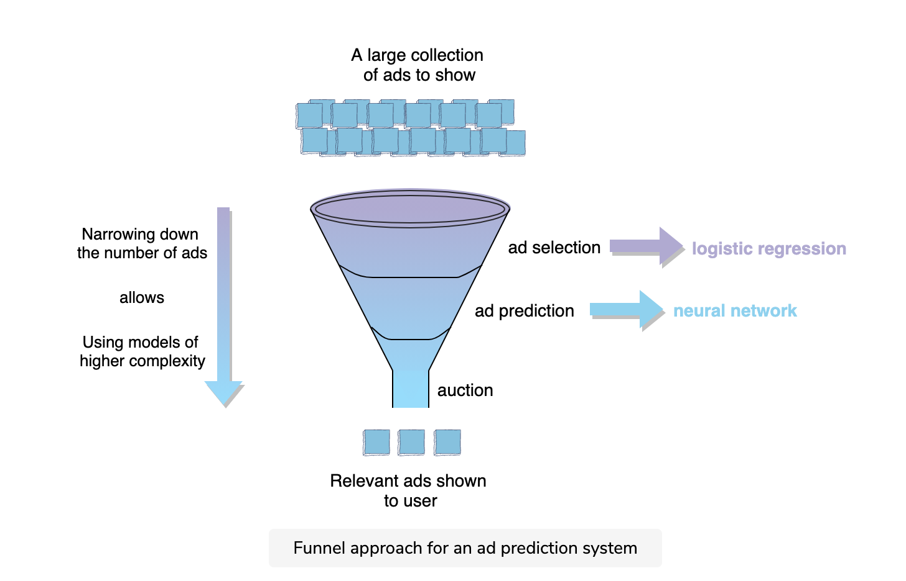

# General Framework of ML System Design

## 1. Clarifying questions

- problem scope
- capacity/scale
	- qps, data size, no. of active user
	- e.g. Search Engine: 5B websites to consider, 10k queries per second
    - e.g. Twitter: 500M daily active user, on averate each user is connected to 100 users, and each user fetches their feed 10 times a day -> 5B calls for the ranking model per day
- performance
	- SLA: evaluation time
		- add more compute (distributed system)
		- layered/funnel design
			- start from a simple model, gradually increase the complexity with less and less data
			- e.g. search ranking, recommendation, and ad prediction
			- 
			- 
	- training time
		- how much training data & capacity is needed
	- live data
		- how reactive is my algorithm? will change occur within 10 min or 10 hrs?
		- how much data can my program handle at once?
		- does it perform worse with more input?

## 2. Metrics

### Online

- metrics that are computed as part of user interaction in a live system
- 2 types
	- component-wise: evaluate the ml model
	- end-to-end: evaluate the system after model is applied
- example online metrics
	- click-through rate 
		- = no. of clicks/no of impressions
		- only include successful clicks, i.e. clicks that have a relatively long dwell time
	- session success rate
		- = no. of successful sessions/no. of total sessions
		- successful sessions can be defined as the ones that have a click with a ten-second or longer dwell time
	- time to success
		- sometimes we have zero-click searches when user's question is answered at the top of result page
		- similar to "number of queries per session"
- A/B testing
	- hypothesis
		- e.g. posts ordered by relevance will get more engagement than chronological
		- e.g. the addition of location feature will increase engagement by 1%
		- e.g. click through rate/watch time/conversion rate will increase by 5%
	- calculate sample size, then split traffic 50/50 between control & experiment group 
	- P-value 
		- The result of a significance test is claimed to be "statistically significant" if the p-value is less than the significance level.
		- p <= alpha: reject H0 - launch the new feature
		- p > alpha: fail to reject H0 - do not launch the new feature
	- what to do if bug online
		- If an A/B test is run with the outcome of a significance level of 95% (p-value ≤ 0.05), there is a 5% probability that the variation that we see is by chance.
		- B/A test
			- switch control & experiment group
			- check if the gain made in A/B testing is same as the loss in B/A testing
			- so we are not overly optimistic
		- long-running A/B tests to check for long term effect

### Offline

- use offline data to measure the quality of your model instead of relying on getting direct feedback from the users of the system
- classification
	- AUC
	- logloss
	- precision/recall/F1 score
		- video rec: reasonable precision, high recall
	- ranking loss
- MAE
- R2
- NDCG: search ranking

### Staging env

- test in staging when offline metrics are looking good
- small % of real traffic
- business metrics: revenue increase/click through rate

## Architecture Components

## Model Details

### Feature Engineering

- personalization
	- logged-in user: profile data, history data
	- not logged-in