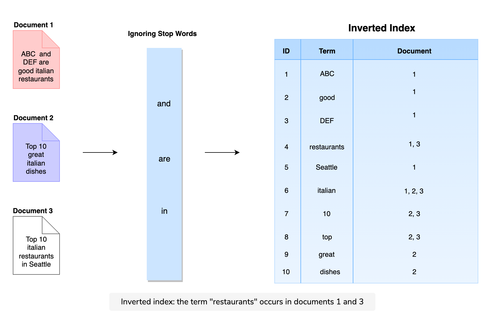
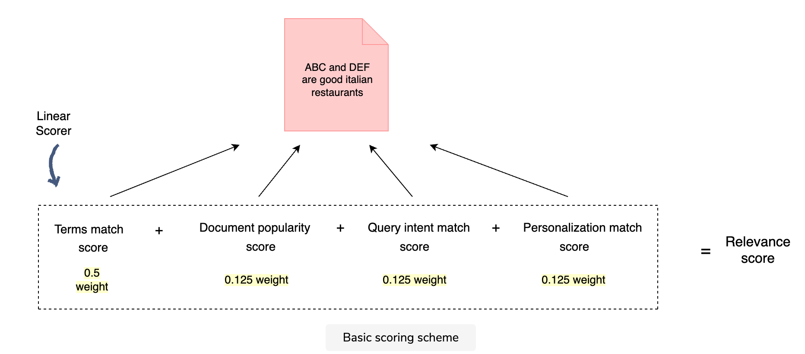
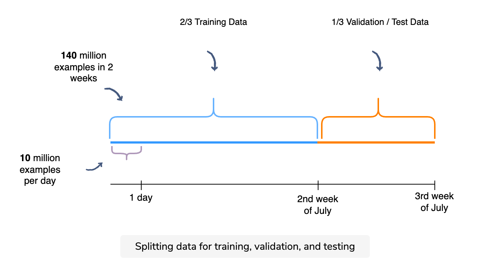

# Search Ranking System Design

## Metrics

- offline
	- human raters rate the relevance of the query results, then aggregate the ratings across a query sample to serve as the ground truth
	- NDCG - normalized discounted cumulative gain
		- the intuition behind it is that the search engine will not be of much use if it doesn’t show the most relevant documents at the top of search result pages
		- penalizes items that appeared later in the list
		- [calculation](https://www.educative.io/courses/grokking-the-machine-learning-interview/xoxmjX77JGP#NDCG)
		- caveat: does not penalizes irrelevant search results, to fix assign negative relevance score instead of just 0

## Architecture

multi-layered funnel/layered model approach: we can choose the appropriate ml algorithm at each stage. scalability ✅
### Query Rewriting
- spell checker: "itlian restaurant" -> "italian restaurant"
- query expansion: add terms to uwer's query, "italian restaurant" -> "italian restaurant" + "italian food" + "italian recipe"
- query relaxation: "good italian restaurant" -> "italian restaurant"
### Query Understanding
- find the main intent behind the query 
- "gas station": local intent
- "earthquake": newsy intent (look for recent information)
### Document Selection
- focuses on recall
- 100 B documents on the internet -> 100k documents relevant to the query
- binary classification: relevant 1/not relevant 0
- **pointwise**
    - logistic regression or small MART (multiple additive regression trees)
    - the ability to score each document extremely quickly (< ms) for the fairly large document pool is critical 
    - compare model performance with AUC / ROC
- information retrieval: compares query text with the document text to determine whether it's a good match 
    - inverted index: word -> set of document id 
        
    - "intalian restaurant" -> retrieve document that match ("italian") and ("restaurant" or "food")
    - relevance score: weighted sum
        
        - terms match: IDF (inverse document frequency) score
        - document popularity: stored in the index
- not ranking yet
### Ranker
- focuses on precision, find the optimized rank order
- **pairwise**
    - LambdaMART or LambdaRank
    - compare model performance with NDCG
- If the number of documents from the document selection stage is significantly large (more than 10k) and the amount of incoming traffic is also huge (more than 10k QPS or queries per second), you would want to have multiple stages of ranking with varying degrees of complexity and model sizes for the ML models. Multiple stages in ranking can allow you to only utilize complex models at the very last stage where ranking order is most important. This keeps computation cost in check for a large scale search system.
- 100k documents -> a fast linear model -> top 500 apply a deep learning model to find the best order
### Blender
- gives relevant results from various search verticals, like, images, videos, news, local results, and blog posts
- "italian restaurant" -> blend websites, local results, and images
- increase result diversity, make it more relevant
- outputs a search engine result page (SERP) in response to the searcher’s query
### Filter
- inappropriate content: misinformation, not age appropriate etc

## Ranker: Feature Engineering
- 4 actors 
    - searcher
        - age
        - gender: "clothing brands" -> "female clothing brands"
        - interest: "shooting" -> if previously shown interest in photography "photography results", if previously shown interest in guns "arcade shooting results"
    - query
        - query's historical engagement (prior)
            - popular queries
        - query's intent
            - e.g. news, local, commerce
    - document
        - document engagement radius: a local restaurant with a 10-mile radius engagement vs Eiffel Tower that might interest people all around the world. local appeal vs global appeal
        - document rank: the number and quality of the documents that link to it
    - context
        - time of search: "restaurants" -> "restaurants that are open right now"
        - nature of previous queries
            - if user searched "python", "java" a lot, when they search "go", it's more likely they are looking for the programming language not the english word
    - searcher + document
        - distance between searcher and document: find nearby locations
        - historical engagement: if user has engaged with video documents more in the past, or maybe a particular website. maybe they are trying to "re-find" the document
    - query + document
        - text match: texts in query match with document title/metadata/content
        - unigram/bigram: "Seattle tourism guide" -> 3 unigrams "seattle", "tourism", "guide". These unigrams may match different parts of the document, e.g., “Seattle” may match the document title, while “tourism” may match the document’s content. Similarly, we can check the match for the bigram and the full trigram, as well. All of these text matches can result in multiple text-based features used by the model.
        - TF-IDF score
            - TF (term frequency): importance of each term for the document
            - IDF (inverse document frequency): how much information a term provides
        - BM25 score
        - embeddings
            - use embeddings to represent the query and documents in the form of vectors
            - then calculate the embedding similarity score between the query vector and document vector
        - query-document historical engagement (click rate)
            - for all queries of "Paris travel", Eiffel Tower official website receives the most clicks, should rank higher
## Learning To Rank
- learning to rank refers to supervised models to solve ranking problems, commonly used in information retrieval
- pointwise: looks at a single document at a time. all standard regression & classification algorithms can be used here. 
    - simplified version: classify if document is relevant or irrelevant. binary classification 
- pairwise: looks at a pair of documents at a time and try to come up with the optimal ordering for that pair. minimize inversions in ranking. can use some fancy SVM flavored model.
- listwise: looks at the entire list of documents and try to come up with the optimal ordering. can get complex
## Training Data - Pointwise 
### Generation
- if user clicked on a link: positive data
- if didnt click: negative data
    - if user engages only with the first document, we wont get enough negative examples
    - use random negative examples: results on the 50th page of google 
- say we receive 5M queries per day, each query we generate 2 positive 2 negative examples -> 20M training examples per day  
### Train Test Split
- time series data so split by time
    

## Training Data - Pairwise 
### Generation
- (offline) human raters: 100k queries each with 10 results, rate the results of each query from -1 bad to 1 fair, 2 good, 3 excellent, 4 perfect -> 1M training examples
- (online) user engagement: "no click" -> 0, "clicked & stayed to 10 sec" -> 3 excellent, "clicked & signed up, 2 min" -> 4 excellent

