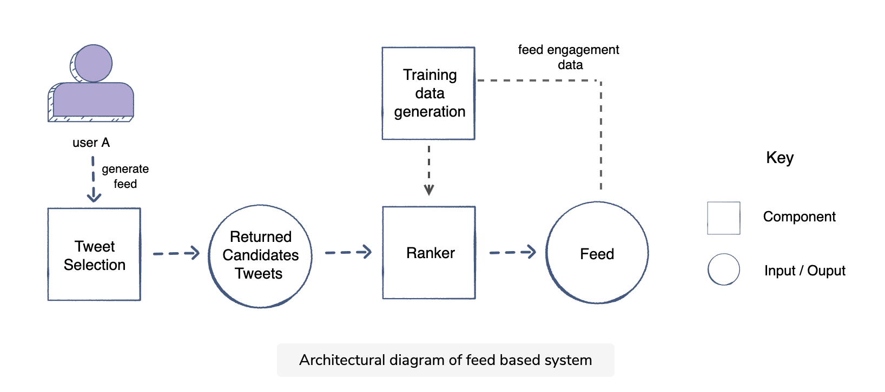

# Twitter Feed System Design
design a Twitter feed system that will show the most relevant tweets for a user based on their social graph. 

cant just display the new tweets in reverse chronological order because people may miss out on more engaging contents, need to take into consideration user interests and social connections -> relevance ranking

ML Formulation: give a list of tweets, train an ML model to predict the probability of engagement of tweets and orders them based on that score. 

## Metrics

- online
    - user engagement metrics: weighted sum of comments + likes + retweets/time spent on platform 
        /weighted_sum_user_engagement_twitter.png
    - negative engagement/counter metric: average negative action per user (report a tweet, block a user, hide a tweet, etc.)

## Architecture 

### Tweet Selection

- fetches a pool of tweets from the user's followees, since their last login
    - unseen tweets
    - seen tweets, but has received a lot of engagement since the user last saw it
- forward them to the ranker

### Ranker

- predicts the probability of engagement for a pool of tweets
- then rank them based on the probability
- model
    - train a single model to predict the overall engagement on the tweet, or
    - train separate models for the probability of each user action (like, comment, time spent, share, hide, report), then combine the results with a weight to create a rank score

## Training Data

### Generation

- (online) user engagement: positive & negative examples

## Problem Scale